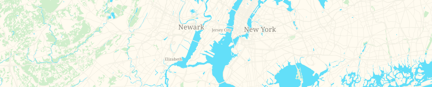

G12N Maps: Bright V0.5
======================

CartoCSS Style based on shades of sand and pale green. Frugal use of labels and colors makes it ideal as an esthetic background to present additional GEO-Information.

Designed to work with [OSM2VectorTiles](http://osm2vectortiles.org/).

You find a documetation hor to Serve Raster Tiles with Docker over on their site: [http://osm2vectortiles.org/docs/serve-raster-tiles-docker/](http://osm2vectortiles.org/docs/serve-raster-tiles-docker/)

